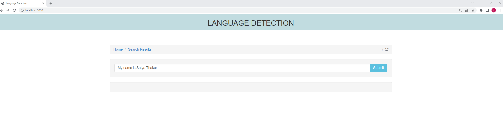
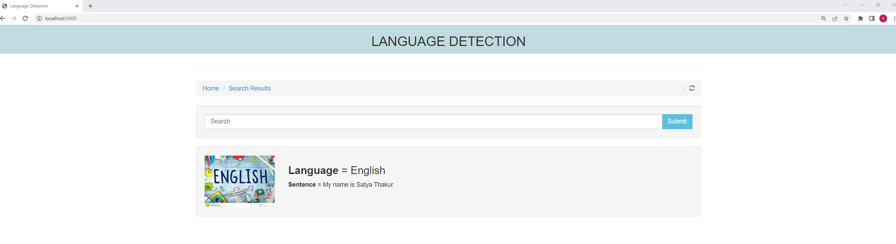

<div align="center">

# Language Detection Using NLP & Machine Learning💫

---

This project aims to build a machine learning model trained on this dataset to predict new unseen data. The Language Detection falls basically into Text Classification part


# About Dataset
Dataset is collected from Kaggle, which contains data about 22 popular languages and contains 1000 sentences in each of the languages

English
Portuguese
French
Greek
Dutch
Spanish
Japanese
Russian
Danish
Italian
Turkish
Swedish
Arabic
Malayalam
Hindi
Tamil
Telugu

---

# 💻Tech Stack  
         


---

##  <b> API</b>


Landing Page of Application


Interface to upload audio file



</div>
## How to run?

### Step 1: Clone the repository
```bash
git clone "https://github.com/Machine-Learning-01/Language_Detection.git" repository
```

### Step 2- Create a conda environment after opening the repository

```bash
conda create -p env python=3.10 -y
```

```bash
conda activate env/
```

### Step 3 - Install the requirements
```bash
pip install -r requirements.txt
```

### Step 4 - Export the  environment variable
```bash
export AWS_ACCESS_KEY_ID=<AWS_ACCESS_KEY_ID>

export AWS_SECRET_ACCESS_KEY=<AWS_SECRET_ACCESS_KEY>

export AWS_DEFAULT_REGION=<AWS_DEFAULT_REGION>

```
Before running server application make sure your `s3` bucket is available and empty

### Step 5 - Run the application server
```bash
python app.py
```

### Step 6. Train application
```bash
http://localhost:8080/train
```

### Step 7. Prediction application
```bash
http://localhost:8080
```

## Run locally

1. Check if the Dockerfile is available in the project directory

2. Build the Docker image

```
docker build -t test .

```

3. Run the Docker image
****
```

docker run -d -p 8080:8080 <IMAGEID>
```

🌐  <h3>Infrastructure Required.</h3>
1. AWS S3
2. ECR (Amazon ECR repository)
3. EC2 (Amazon EC2 Instance)
4. GitHub Actions

**Artifact** : Stores all artifacts created from running the application

**Components** : Contains all components of Machine Learning Project
- DataIngestion
- DataTransformation
- ModelTrainer
- ModelEvaluation
- ModelPusher

**Custom Logger and Exceptions** are used in the project for better debugging purposes.


## Take Aways

You now have a better understanding of 
-  NLP Basic concepts like Text Preprocessing and Vectoriztion techniques.
-  Webframework like Flask.

=====================================================================